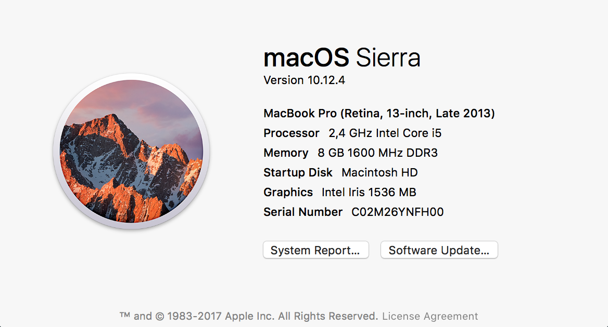
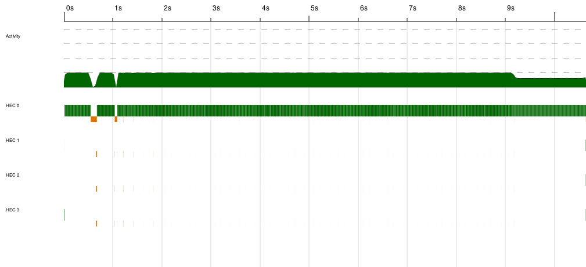
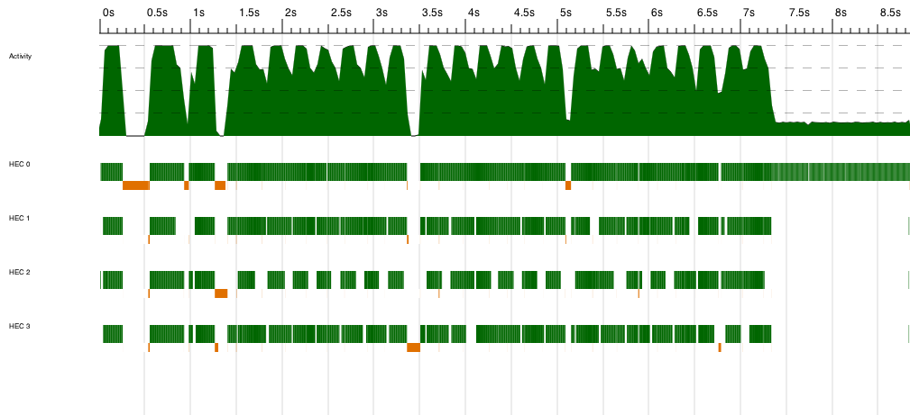
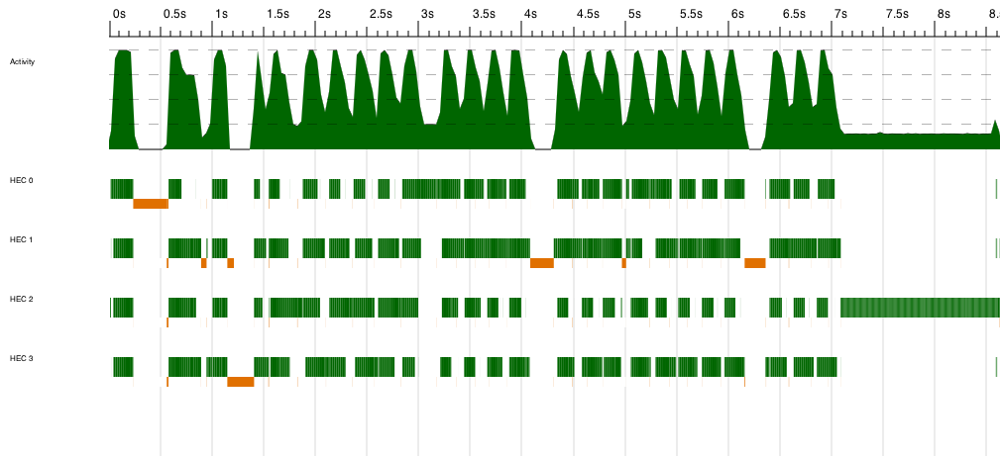
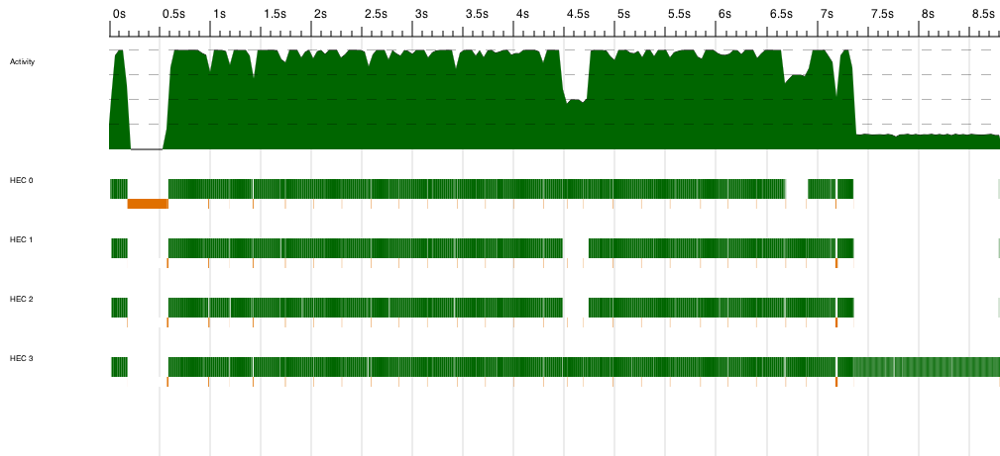
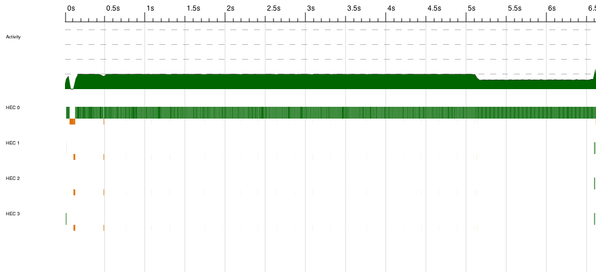
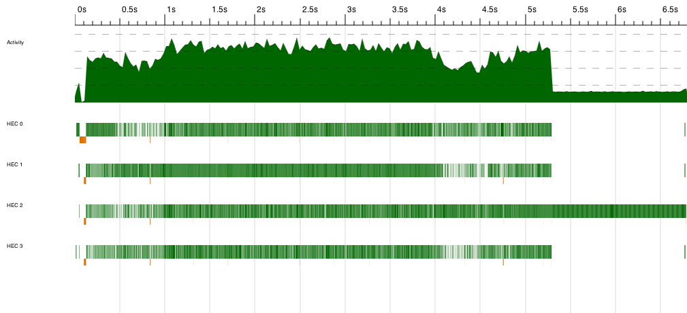
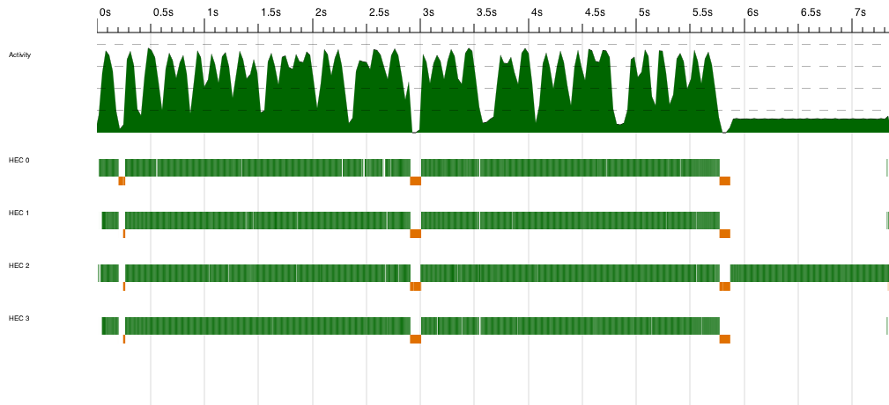

# DAT280 – Lab A: “Parallel Programming in Haskell”

*Olle Svensson (ollesv@student.chalmers.se)*

*Agazi Berihu (agazi@student.chalmers.se)*

## Setup
The benchmarks have been performed on the following machine:

The complete model name for the processor is **Intel(R) Core(TM) i5-4258U CPU @
2.40GHz**. This processor has two physical and four logical cores.

The executable has been run with the following additional flags to increase
performance and reduce time spent garbage collecting: ** -N4 -A100M -H2G**.

The executable was also compiled with the **-O2** flag to allow the GHC
compiler to perform as many optimisations as possible.

All implementations with manual granularity have been run with a depth of 2
since this gave the best result.

## Assignment 1
We start by running a benchmark on the standard `map` function as a starting
point for our comparisons.

**Benchmark 1.1 – map**

The second benchmark is done on `Main.parMap` which uses `par` and depth. It
does not use `pseq` to wait for sub results since we found that the runtime
were faster without. This leads to a slight increase in performance from a
runtime of approximately 11 seconds in benchmark 1.1 to 9 seconds in 1.2.

**Benchmark 1.2 – Main.parMap (a)**

The third benchmark is done on `parMapRD` which is implemented in a similar
way as `Main.parMap` but uses the Eval-monad instead. The runtime is around 9
seconds here as well as in 1.2, which is expected since it is basically the
same function but wrapped in a monad instead.

**Benchmark 1.3 – parMapRD (b)**

Benchmark 1.4 is done on `parMapS` which uses the Strategies library. Different
from 1.2 and 1.3 is that it does not use depth but creates a spark for each
element in the list that could theoretically be run in parallel. This yields
a further increase in performance to a runtime of around 8 seconds.

**Benchmark 1.4 – parMapS (c)**

Finally, the fifth benchmark is done on `parMapP` which uses the Par-monad
without depth. The runtime is around 9 seconds.
**Benchmark 1.5 – parMapP (d)**

## Assignment 2
As in the previous case we start with a benchmark of a standard implementation
of merge sort. The runtime is around 6.5 seconds.

**Benchmark 2.1 – mergesort**

In the first parallelised version that we benchmark uses `pseq` but
unfortunately the runtime is still around 6.5 seconds.

**Benchmark 2.2 – mergesortPseq**

The third benchmark uses uses `rpar` and depth. Runtime is still around 6.5
seconds.

**Benchmark 2.3 – mergesortRD**

Finally we tried a version using the Par-monad which gave a runtime of roughly
7 seconds.

**Benchmark 2.4 – mergesortP**

## Conclusions

Regarding the parallelised map we found that `parMapS` was the fastest by
parallelising each element and not using depth. Even though this made the spark
tasks small and possibly introducing excessive overhead, it was still fastest.
One possible reason for not improving the performance with depth could be that
by manually controlling the granularity, we split the list in half and solve
the halves in parallel. Before a final result can be returned, these sub lists
must be joined again. The join operation (++) is **O(n)** which becomes
relatively costly in our context. We believe that the time saved by reducing
spark overhead is lost by the number of joins needed in our implementations
with depth and granularity.

Unfortunately we were unable the improve the performance in the merge sort case.
Even though merge sort should yield good results when parallelised. Still, it
is not as "embarrassingly parallel" as map where all intermediate results a
independent of each other. It was mentioned during the lectures that one should
have a 4-core machine the really make the course "fun". Maybe the 2 cores of our
benchmark machine was not enough to make the parallelisation really shine.
